 

## Sobre mí

Desarrollador fullstack enfocado en **arquitecturas escalables**, **APIs limpias** y **experiencias web y móviles** cuidadas al detalle. Me muevo cómodo entre backend, frontend, CI/CD y monitoreo en producción.

- 🔭 Actualmente en **Davivienda**: Python, React y observabilidad
- 📱 Especialista en desarrollo móvil multiplataforma
- 🌱 Siempre aprendiendo e iterando

## Stack

  

## Proyecto destacado

  
   
  <a href="https://github.com/Andresjl389?tab=repositories"><b>Ver más proyectos →</b></a>

## Experiencia y formación

  

## Fortalezas

  

## Contribuciones

  <picture>
    <source media="(prefers-color-scheme: dark)" srcset="https://raw.githubusercontent.com/Andresjl389/Andresjl389/output/github-snake-dark.svg">
    
  </picture>

  
<b>📈 Más estadísticas</b> (servicios externos, pueden tardar en cargar)

   
  

    
    
  

 

